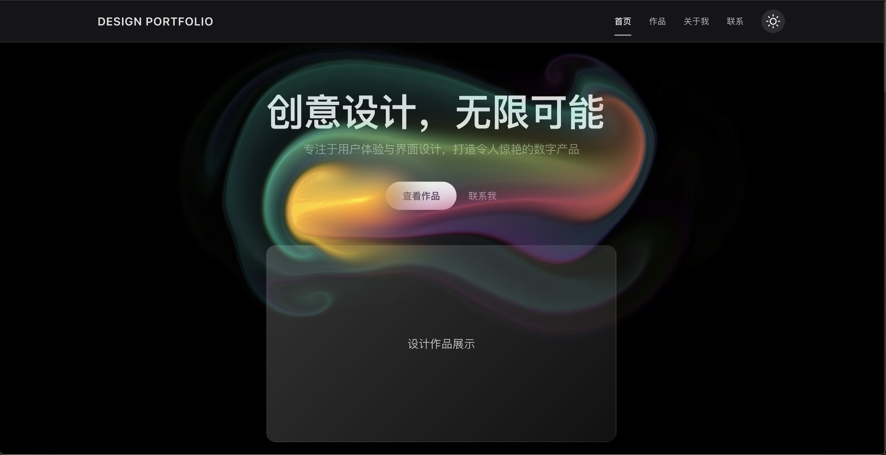
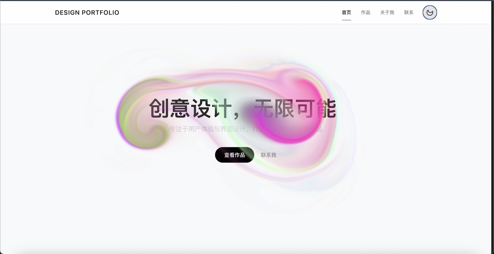

# ✨ Design Portfolio Website ✨

<div align="center">
  
  
</div>

A modern, responsive portfolio website showcasing creative design and digital products. Built with React, TypeScript, and Framer Motion, this website features smooth animations and an elegant user interface.

## 🌐 Live Demo

🔗 **Live Preview**: [http://www.irving-design.top/](http://www.irving-design.top/)

You can experience the website directly through the link above, no local deployment needed!

## 🌟 Key Features

- 🎯 **Minimalist Design** - Clean and focused presentation of works
- 🔥 **Smooth Animations** - Carefully crafted transitions and interactions
- 🌐 **Responsive Layout** - Perfect display across all devices
- 🎨 **Portfolio Showcase** - Detailed presentation of design concepts and processes
- 🌓 **Dark/Light Mode** - Switch between dark and light themes for comfortable viewing

## 🛠️ Tech Stack

- ⚛️ **React** + **TypeScript** + **Vite** - Modern frontend development framework
- 🌈 **Framer Motion** - Powerful animation library for smooth transitions
- 📱 **Responsive Design** - Perfect adaptation to various screen sizes

## 🚀 Quick Start

```bash
# Install dependencies
yarn install

# Start development server
yarn dev

# Build for production
yarn build
```

## 📁 Project Structure

```
src/
├── assets/     # Static assets
├── components/ # Reusable components
├── styles/     # Style files
└── types/      # TypeScript type definitions
```

---

```

---

💻 **设计与开发** | 🌟 **创意无限**
