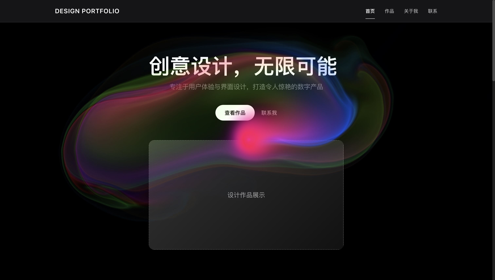

# ✨ 设计作品集网站 ✨



## 🎨 项目简介

一个专注于用户体验与界面设计的作品集网站，展示创意设计和数字产品。通过精美的布局和流畅的交互，为访问者带来愉悦的浏览体验！

## 🚀 技术栈

- ⚛️ **React** + **TypeScript** + **Vite** - 现代前端开发框架
- 🌈 **Framer Motion** - 强大的动效库，带来流畅的动画体验
- 📱 **响应式设计** - 完美适配各种设备屏幕

## ✨ 项目特点

- 🎯 **简约美学** - 极简设计风格，突出作品展示
- 🔥 **流畅动效** - 精心设计的过渡动画，提升用户体验
- 🌐 **跨设备兼容** - 从手机到桌面，始终保持最佳视觉效果
- 🔍 **作品详情** - 深入展示设计理念与实现过程

## 🔧 快速开始

```bash
# 安装依赖
yarn install

# 启动开发服务器
yarn dev

# 构建生产版本
yarn build
```

## 📝 项目结构

```
src/
├── assets/     # 静态资源文件
├── components/ # 可复用组件
├── styles/     # 样式文件
└── types/      # TypeScript类型定义
```

## 🌐 在线预览

🔗 **项目预览地址**: [http://101.37.85.94:8889/](http://101.37.85.94:8889/)

通过上面的链接，您可以直接体验网站的实际效果，无需本地部署！

---

💻 **设计与开发** | 🌟 **创意无限**
